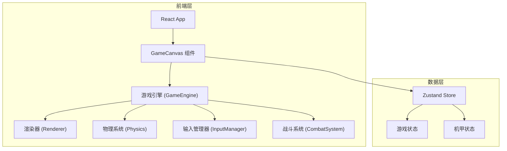

## 1. 架构设计



## 2. 技术说明
- 前端：React@18 + TypeScript + Tailwind CSS + Vite
- 初始化工具：vite-init
- 后端：无（纯前端游戏）
- 数据库：无（内存状态管理）
- 游戏渲染：HTML5 Canvas 2D API
- 状态管理：Zustand

## 3. 路由定义
| 路由 | 用途 |
|------|------|
| / | 开始页面，含标题、操作说明、开始按钮 |
| /battle | 战斗场景，Canvas游戏主画面 |
| /result | 结算页面，胜负展示与再来一局 |

## 4. 核心模块设计

### 4.1 游戏引擎 (GameEngine)
- 60fps 游戏主循环 (requestAnimationFrame)
- 管理游戏状态机：READY → FIGHT → KO → RESULT
- 协调各子系统更新与渲染

### 4.2 渲染器 (Renderer)
- Canvas 2D 绘制，使用 image-rendering: pixelated 保持像素锐利
- 分层渲染：背景层 → 角色层 → 特效层 → HUD层
- 精灵动画帧管理

### 4.3 输入管理器 (InputManager)
- 监听键盘事件，映射为游戏操作
- 玩家1：W(跳)/A(左)/D(右)/S(蹲)/J(攻击)/K(防御)
- 玩家2：↑(跳)/←(左)/→(右)/↓(蹲)/1(攻击)/2(防御)

### 4.4 战斗系统 (CombatSystem)
- 碰撞检测：AABB矩形碰撞
- 伤害计算：基础攻击力 × (1 - 防御减免)
- 攻击类型：普通攻击（近战拳击）、重击（蓄力攻击）
- 防御状态：按住防御键时减免50%伤害，但无法移动
- 击退效果：受击后短暂后退与硬直

### 4.5 机甲数据模型
```typescript
interface Mecha {
  x: number
  y: number
  width: number
  height: number
  velocityX: number
  velocityY: number
  hp: number
  maxHp: number
  energy: number
  maxEnergy: number
  facing: 'left' | 'right'
  state: 'idle' | 'walk' | 'jump' | 'attack' | 'defend' | 'hurt' | 'ko'
  stateTimer: number
  attackType: 'normal' | 'heavy'
  isGrounded: boolean
  comboCount: number
}
```

### 4.6 游戏配置
```typescript
interface GameConfig {
  canvasWidth: number
  canvasHeight: number
  pixelScale: 2
  gravity: number
  groundY: number
  maxHp: 100
  normalAttackDamage: 10
  heavyAttackDamage: 20
  defenseReduction: 0.5
  moveSpeed: 3
  jumpForce: -8
  roundTime: 60
  hurtStunFrames: 15
  attackFrames: 12
}
```

## 5. 文件结构
```
src/
├── components/
│   ├── GameCanvas.tsx       # Canvas容器组件
│   ├── StartScreen.tsx      # 开始页面
│   ├── BattleScreen.tsx     # 战斗页面
│   ├── ResultScreen.tsx     # 结算页面
│   └── HudOverlay.tsx       # HUD叠加层
├── game/
│   ├── engine.ts            # 游戏主引擎
│   ├── renderer.ts          # 像素渲染器
│   ├── input.ts             # 输入管理器
│   ├── combat.ts            # 战斗系统
│   ├── physics.ts           # 物理系统
│   ├── sprites.ts           # 精灵绘制函数
│   ├── backgrounds.ts       # 背景绘制函数
│   ├── effects.ts           # 特效系统
│   └── config.ts            # 游戏配置常量
├── store/
│   └── gameStore.ts         # Zustand游戏状态
├── pages/
│   └── GamePage.tsx         # 主页面路由
├── App.tsx
└── main.tsx
```
